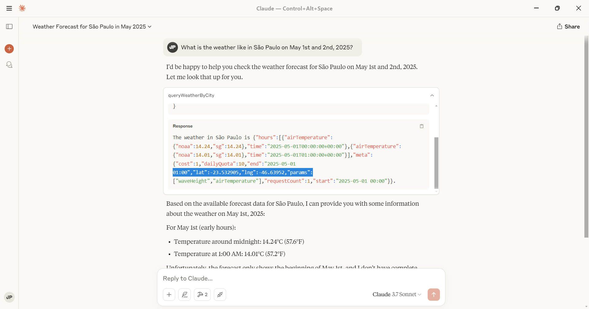

# MCP Server Example

A Domain-Driven MCP server that provides real-time weather information for Brazilian cities. Designed with SOLID principles, it leverages dependency injection and separates domain logic from infrastructure services to ensure scalability, maintainability, and testability.
[Model Context Protocol concept](https://docs.mcp.so/)

# Installation

Use the package manager [npm](https://www.npmjs.com/) to install MCP server.

```bash
npm install
```

## Simple use with Claude Desktop APP

- Dowloading Claude Desktop APP in [link](https://claude.ai/download)
- Config your MCP server in Claude APP MCP config (file claude_desktop_config.json) [more infos](https://modelcontextprotocol.io/quickstart/user).



## Contributing

If you've ever wanted to contribute to open source, and a great cause, now is your chance!

See the [contributing docs](CONTRIBUTING.md) for more information

## Contributors ✨

<!-- ALL-CONTRIBUTORS-LIST:START - Do not remove or modify this section -->
<!-- prettier-ignore-start -->
<!-- markdownlint-disable -->

<table>
  <tr>
    <td align="center"><a href="https://github.com/dev-jpnobrega"><br /><sub><b>JP. Nobrega</b></sub></a><br /><a href="https://github.com/dev-jpnobrega/api-rest/issues" title="Answering Questions">💬</a> <a href="https://github.com/dev-jpnobrega/api-rest/master#how-do-i-use" title="Documentation">📖</a> <a href="https://github.com/dev-jpnobrega/api-rest/pulls" title="Reviewed Pull Requests">👀</a> <a href="#talk-kentcdodds" title="Talks">📢</a></td>
  </tr>
</table>

<!-- markdownlint-enable -->
<!-- prettier-ignore-end -->

<!-- ALL-CONTRIBUTORS-LIST:END -->

## License

[MIT](LICENSE)
